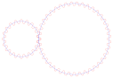

# ⚙ GearForge

**Standards-correct involute gears, timing-belt pulleys and splines — exported as
laser-ready, kerf-compensated SVG / DXF. Zero dependencies, runs in your browser.**

**Live app → https://1400130-collab.github.io/gearforge/**

| Meshing pair (m2, z20 : z40) | Undercut pinion (z8, trochoidal root) | GT2 20T pulley | ISO 4156 spline hub |
|---|---|---|---|
|  |  |  |  |

## What it generates

- **External spur gears** — ISO 21771 geometry, DIN 867 / ISO 53 basic rack
  (ha\*=1.00, hf\*=1.25, ρf\*=0.38), pressure angles 14.5°/20°/25°, profile shift,
  circular-backlash allowance, **true rack-generated trochoidal root fillets**
  (undercut on low tooth counts is reproduced correctly, not approximated).
- **Internal / ring gears** — annulus with involute toothed bore, rim sizing, bolt circles.
- **Racks** — mm-true pitch, analytic corner fillets, mounting holes.
- **Timing pulleys** — GT2 (2/3/5 mm), HTD 3M/5M/8M, T2.5/T5/T10, AT5, MXL/40DP/XL/H.
  `OD = z·p/π − 2·PLD` with the industry-standard SDP/SI groove profiles; adjustable
  belt-fit clearance.
- **Involute splines** — ISO 4156 / ANSI B92.1, 30° pressure angle, flat and fillet
  root, external shaft + internal hub cross-sections, side-fit clearance.
- **Bores & features** — round, D-flat, hex, square, and round + **DIN 6885 keyway**
  (standard b×h / t2 table), bolt-circle holes.

## Laser-ready output

- **SVG** with real-millimetre width/height + matching viewBox (imports mm-true into
  LightBurn, Inkscape, xTool CS, Glowforge…). Layers: `CUT` (red) and `ENGRAVE` (blue,
  pitch circle + centermark + label).
- **DXF R12** (`POLYLINE`/`CIRCLE`/`TEXT`, metric header, CUT/ENGRAVE layers) for CAM
  tools that prefer DXF.
- **Kerf compensation**: the beam path is offset by kerf/2 along the outward material
  normal — outer contours grow, holes shrink — so the finished part is dimensionally true.
- **Dimension & inspection report** (plain text): pitch/base/tip/root diameters, tooth
  thickness, **span measurement Wₖ** and **measurement over pins M** so you can verify a
  cut gear with calipers, plus pair data (working center distance, working pressure
  angle, transverse contact ratio εα).

## Why you can trust the geometry

`node tests/run-tests.js` runs 25 checks that compare *generated point geometry*
against independent closed-form standards formulas, including:

- tooth thickness sampled from the generated flank vs. `s = m(π/2 + 2x·tanα) − Δs` (≤ 1 µm);
- a pin placed numerically against the generated flanks vs. the closed-form
  measurement-over-pins (≤ 5 µm) across a parameter sweep;
- span measurement vs. `Wₖ = m·cosα(π(k−½) + z·invα) + 2x·m·sinα`;
- working center distance / contact-ratio round-trips;
- a z20:z40 pair **rolled through a full tooth pitch with point-in-polygon
  interference checking — zero interpenetration**;
- undercut cases (z=8 and below) still produce simple, closed, laser-cuttable polygons;
- GT2 20T pulley outside diameter = 12.224 mm (commercial spec), groove counts, pitch
  consistency `z·p = π·d` for all 14 belt profiles;
- ISO 4156 major/minor diameters reproduced by the generated splines;
- kerf offsets verified radially and for self-intersection;
- DXF group-code structure and SVG mm-true headers.

### The root-fillet math (the part most generators get wrong)

The root fillet is generated exactly as a hob/rack cutter would: the rack tip corner
(radius ρ) is rolled over the pitch circle, its center tracing
`C(φ) = R(φ)·(ξc + rp·φ, rp + ηc)`. By the fundamental law of gearing the contact
normal passes through the instantaneous pitch point `I(φ)`, so the cut surface is
`P(φ) = C(φ) + ρ·unit(C(φ) − I(φ))` — the true trochoid envelope. The tooth boundary
at each radius is then the *minimum half-angle over all cutter elements* (corner
envelope, folded across the space centerline for the adjacent corner, plus the involute
which is only valid above the form radius
`r_Ff = √(rb² + (rp·sinα − h_fEff/sinα)²)`). This handles tangent joins, undercut
loops and cross-centerline cuts in one uniform construction — no special cases.

## Run it

- **Online:** https://1400130-collab.github.io/gearforge/
- **Locally:** clone and open `index.html` — it works from `file://`, no build, no server,
  no dependencies. (Optional: `python3 -m http.server` if you prefer.)
- **Tests:** `node tests/run-tests.js` (Node ≥ 18, uses `node:test`).

## Layout

```
index.html / style.css     UI shell
src/geometry.js            vectors, arcs, RDP, kerf offset, bores/keyways
src/involute.js            spur/internal/rack generation + mesh & inspection math
src/pulley.js              14 belt profiles + pulley generation
src/spline.js              ISO 4156 splines (shaft + hub)
src/exporters.js           SVG + DXF R12 writers, report
src/app.js                 UI: forms, live preview, mesh animation, exports
tests/run-tests.js         geometry-vs-formula test suite
PLAN.md                    design document
```

## Practical laser notes

- Measure your kerf on scrap (cut a 10 mm square, measure, kerf = 10 − measured).
  Typical: ~0.1–0.2 mm for 3 mm plywood/acrylic on a diode/CO₂ laser.
- Acetal (Delrin/POM) and acrylic make good gears; plywood works for prototypes.
- Small modules (< 1 mm) approach kerf scale — expect reduced accuracy; the app warns
  when kerf/2 is large relative to the root fillet radius.
- Gears run best with a small backlash allowance (default 0.05 mm) plus whatever your
  kerf calibration error leaves.

## Standards & data provenance

Geometry follows ISO 21771 / DIN 867 / ISO 53 (spur gearing), ISO 4156 / ANSI B92.1
(involute splines), DIN 6885 (keyways). Timing-belt groove outlines and pitch-line
differentials are dimensional data from published SDP/SI belt specifications, as
popularized by droftarts' parametric pulley (Thingiverse thing:16627) and proven by
years of community use.

## License

MIT — see [LICENSE](LICENSE). Contributions welcome; every geometry change must keep
`node tests/run-tests.js` green.
